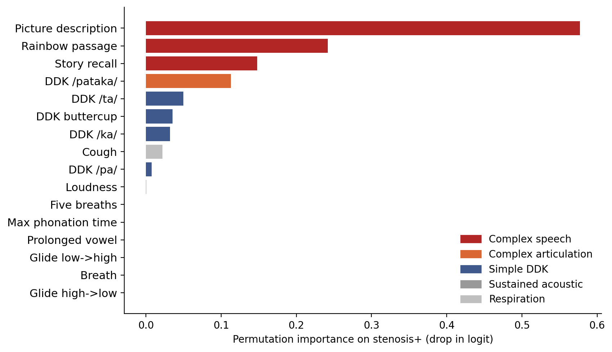

# Listening for Airway Stenosis

Code for **"Listening for Airway Stenosis: A Foundation Model-Based Method for Rapid and Accessible
Detection"**.

Jean Groeninger<sup>1,2,\*</sup>, Zihao Zhao<sup>1,\*</sup>, Juliana de Castilhos<sup>1</sup>,
Sven Nebelung<sup>1</sup>, Daniel Truhn<sup>1</sup>
<sup>1</sup> Department of Diagnostic and Interventional Radiology, University Hospital Aachen ·
<sup>2</sup> Télécom Paris · <sup>\*</sup> equal contribution

Airway stenosis is normally found with endoscopy, CT or pulmonary function testing. This work asks
whether a few seconds of recorded voice carry enough information to detect it. Each patient performs
a set of speech tasks; a frozen acoustic foundation model turns every recording into an embedding,
and a multiple-instance learning head aggregates the whole set into one patient-level prediction.

**The tables and the figure in the paper regenerate from this repository on a laptop, with no GPU
and without access to the dataset.** The per-run metrics are shipped in `results/`.

```bash
pip install -r requirements.txt
python make_tables.py          # Tables 1, 2(a), 2(b), 3
python figures/make_fig2.py    # Figure 2
```

---

## Results

Patient-level 5-fold cross-validation on **748 patients: 134 with airway stenosis, 614 controls**.
Model selection and performance estimation share the same cross-validation folds, so these are
cross-validated development figures.

### Table 1 · comparison of feature extraction methods

| Pretraining | Method | AUROC | F1-score | Accuracy | Aggregation head |
|---|---|---|---|---|---|
| Baseline | Handcrafted (mel + MFCC + F0) | 0.792 ± 0.030 | 0.484 ± 0.073 | 0.767 ± 0.049 | DSMIL |
| General audio | AST | 0.886 ± 0.017 | 0.579 ± 0.045 | 0.861 ± 0.014 | mean-pool + LogReg |
| General audio | AudioMAE | 0.806 ± 0.042 | 0.479 ± 0.083 | 0.799 ± 0.033 | mean-pool + LogReg |
| General audio | OpenBEATs | 0.751 ± 0.054 | 0.444 ± 0.082 | 0.780 ± 0.052 | mean-pool + LogReg |
| General audio | SSAST | 0.818 ± 0.032 | 0.498 ± 0.046 | 0.832 ± 0.011 | mean-pool + LogReg |
| General audio | YAMNet | 0.816 ± 0.047 | 0.529 ± 0.061 | 0.822 ± 0.030 | mean-pool + LogReg |
| Speech | HuBERT-Large (L10) | 0.943 ± 0.032 | 0.728 ± 0.062 | 0.894 ± 0.026 | GatedAttention |
| Speech | Whisper-Large-v3 (L32) | 0.925 ± 0.009 | 0.692 ± 0.037 | 0.888 ± 0.024 | mean-pool + LogReg |
| **Speech** | **WavLM-Large (L15)** | **0.952 ± 0.033** | **0.783 ± 0.077** | **0.924 ± 0.026** | **TransMIL** |

Every speech-pretrained model clears 0.92 AUROC, while the best general-audio model reaches 0.886.
The aggregation head is not the same on every row: each encoder is reported with its best-performing
head, and the column makes that explicit.

### Table 2 · ablations on WavLM

(a) layer selection, TransMIL aggregation &nbsp;&nbsp;|&nbsp;&nbsp; (b) aggregation strategy, layer 15

| Layer | AUROC | F1-score | Accuracy |
|---|---|---|---|
| L6 | 0.930 ± 0.030 | 0.697 ± 0.057 | 0.884 ± 0.033 |
| L10 | 0.942 ± 0.033 | 0.705 ± 0.052 | 0.893 ± 0.017 |
| **L15** | **0.952 ± 0.033** | **0.783 ± 0.077** | **0.924 ± 0.026** |
| L20 | 0.926 ± 0.038 | 0.720 ± 0.063 | 0.886 ± 0.033 |
| L24 | 0.923 ± 0.038 | 0.728 ± 0.068 | 0.896 ± 0.038 |

| Aggregation | AUROC | F1-score | Accuracy |
|---|---|---|---|
| Non-MIL (single task) | 0.932 ± 0.041 | 0.712 ± 0.059 | 0.893 ± 0.033 |
| GatedAttention | 0.945 ± 0.041 | 0.762 ± 0.045 | 0.906 ± 0.026 |
| DSMIL | 0.944 ± 0.038 | 0.723 ± 0.049 | 0.892 ± 0.029 |
| **TransMIL** | **0.952 ± 0.033** | **0.783 ± 0.077** | **0.924 ± 0.026** |

"Non-MIL" is a classifier fitted on the single most informative task (picture description) instead of
on the full bag.

### Table 3 · beyond binary detection

| Task | AUROC |
|---|---|
| Localization (3-class) | 0.815 |
| Stridor detection (binary) | 0.783 |
| Severity grading (3-class) | 0.634 |

Pooled out-of-fold AUC, macro one-vs-rest for the 3-class tasks, using HuBERT-Large L10 with
mean-pool + RF, the best sub-task configuration. The cohorts here are small (N = 134 / 75 / 133),
so these results are exploratory. Detection works; fine-grained phenotyping does not yet.

### Figure 2 · which task carries the signal



Leave-one-task-out permutation importance: each task embedding is replaced by the mean embedding of
stenosis-negative training patients, and the drop in the pre-sigmoid logit is measured. Connected
speech dominates (picture description +0.58, rainbow passage +0.24, story recall +0.15), while
sustained vowels and breathing contribute essentially nothing.

---

## The 16 recording task groups

Task names come from the Bridge2AI-Voice protocol and are not self-explanatory, so:

| Family | Task groups | What the patient does |
|---|---|---|
| Complex speech | picture description, rainbow passage, story recall | describes a scene, reads a standard phonetically balanced passage, retells a story from memory |
| Complex articulation | DDK /pataka/ | repeats /pa-ta-ka/ as fast as possible, alternating three places of articulation |
| Simple DDK | DDK /pa/, /ta/, /ka/, "buttercup" | repeats a single syllable or word as fast as possible |
| Sustained acoustic | prolonged vowel, maximum phonation time, loudness, glides low→high and high→low | holds a vowel, sustains it as long as possible, varies loudness, sweeps pitch |
| Respiration | breath, five breaths, cough | breathes and coughs, without phonation |

Recordings belonging to the same group (for example the repeated breath trials) are concatenated, so
each patient is a bag of 16 task-level embeddings.

## Method

1. **Input.** The dataset ships linear magnitude spectrograms rather than waveforms. Models that
   expect a waveform (WavLM, HuBERT, Whisper, YAMNet, and the handcrafted baseline) receive a
   Griffin-Lim reconstruction (`src/griffin_lim.py`, used by `iter_canonical_bags`). Phase is not
   available, so this is an approximation and probably costs some performance; notably the best
   models are the ones running on reconstructed audio. Spectrogram models (AST, SSAST, AudioMAE,
   OpenBEATs) read the spectrogram directly through `iter_canonical_bags_spec`, avoiding a
   spectrogram → waveform → mel round trip.
2. **Embeddings.** Each recording goes through the frozen encoder; the frame axis is mean-pooled to a
   single vector. A patient becomes a bag of 16 vectors.
3. **Aggregation.** A MIL head maps the bag to one patient-level probability. Ten heads are evaluated
   per run, from mean/max pooling with LogReg or RF up to GatedAttention, DSMIL, SetTransformer and
   TransMIL.
4. **Evaluation.** Patient-level stratified 5-fold cross-validation. The decision threshold is chosen
   by maximising F1 on an inner split, never on the evaluation fold.

`src/b2ai_canonical.py` is the single source of truth for the cohort and the task selection, so every
encoder sees exactly the same (patient, task) set and the comparison stays fair.

## Data

This repository distributes **no dataset content**. Bridge2AI-Voice is de-identified, but released
through PhysioNet under credentialed access and the Bridge2AI Voice Registered Access License. Obtain
it there, sign the agreement, then point the code at your copy:

```bash
export B2AI_ROOT=/path/to/physionet.org/files/b2ai-voice/<version>
```

The patient-level split files are not redistributed either: they are derived from the dataset, so
the same access agreement covers them. `data/README.md` documents their schema so you can rebuild
them from your own credentialed copy.

## Reproducing from raw data

Steps 1 and 2 need a GPU and the dataset. Step 3 needs neither and is what `results/` already holds.

```bash
# 1. embeddings, once per encoder
python src/embeddings/compute_embeddings_speech_layered.py --fm wavlm \
    --layers 6,10,15,20,24 --output output/embeddings/embeddings_wavlm_layered.npz --device cuda

# 2. MIL training and cross-validation
python src/run_mil.py --npz output/embeddings/embeddings_wavlm_layered.npz --layer 2 \
    --task_set all --n_folds 5 --output_dir output/mil/fm_wavlm_L15_all --device cuda

# 3. tables and figure
python make_tables.py
python figures/make_fig2.py
```

Layer indices map onto transformer layers as `{0: L6, 1: L10, 2: L15, 3: L20, 4: L24}` for WavLM and
HuBERT, and `{0: L6, 1: L13, 2: L19, 3: L26, 4: L32}` for Whisper. Pass `--npz` **without** `--fm`:
`--fm` also derives the output directory, so if you drop it, set `--output_dir` yourself.

Sub-task results (Table 3) come from `src/run_mil_subtasks.py --target {localization,severity,stridor}`.
Figure 2 is produced in two steps, `src/train_transmil_for_viz.py` then
`src/compute_transmil_attention.py`, which writes the `transmil_attention.npz` shipped here.

SSAST additionally needs its published checkpoints (`SSAST-Base-Frame-400.pth`,
`SSAST-Base-Patch-400.pth`), downloaded manually from the SSAST repository.

## Layout

```
src/            pipeline: canonical cohort, encoders, MIL heads, runners
results/        per-run metrics backing every table (no patient identifiers)
make_tables.py  renders Tables 1, 2(a), 2(b), 3 from results/
figures/        Figure 2 and the script that draws it
data/README.md  split schema and how to obtain the dataset
```

## Citation

See `CITATION.cff`. Third-party code and model licences are listed in `THIRD_PARTY.md`.
This code is released under the MIT licence (`LICENSE`).
